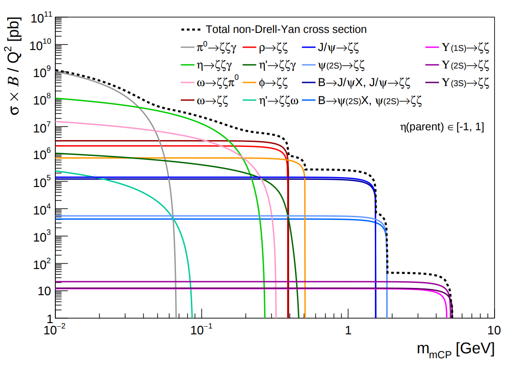

## milliq_mcgen

A collection of tools for generating signal Monte Carlo for the Milliqan experiment:
* Compute cross sections and branching ratios for all main mCP decay modes
* Simulate both two-body and Dalitz decays of parent particles into mCP's
* Generate root files with all relevant information needed to feed generated mCP's into propagation/simulation software

### Contents of subdirectories:

`decayMCP`: Main program to generate mCP decays

`docs`: Documentation

`oniaDirect`: Various tools/data for direct onia production

`oniaFromB`: Theoretical distributions of onia from b decays

`mesonPt`: pT distributions for direct production of non-onia mesons (pi, rho, omega, phi, eta)

`scripts`: scripts to calculate Dalitz and Onia BR, perform two-body and Dalitz decays, and plot/extract mCP cross sections

`utils`: helper C++ functions to compute branching ratios and decay kinematics
